  

 

Hey, I'm Ishant. I turn messy data into pristine lakes. Fresher by title, building enterprise-grade data pipelines by night. No corporate buzzwords, just code that works.

### 🛠 Tech Stack
*The stuff I actually build with:*

  
  
  
  
  
  

### 🚀 Featured Project
**[Real-Time Ecommerce Lakehouse](https://github.com/callbyIshant/real-time-ecommerce-lakehouse)**  
*A fault-tolerant stream processing platform ingesting data through Azure Event Hubs into Databricks (Structured Streaming) and Delta Lake.*

### 📜 Certifications
* *Building...*

### 📊 The Dashboard

  

### 📡 Neural Link (Contact)
[LinkedIn](#) • [X/Twitter](#) • [Portfolio](#)
*(Note: I left these links as placeholders since you didn't provide them yet! You can update them directly).*
